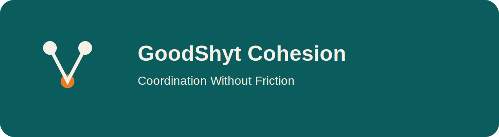

# GoodShyt Cohesion



Collaboration infrastructure for human-AI coordination, task alignment, and distributed execution.

## Brand line
**Coordination Without Friction**

## Features
- skill-based assignment
- capacity-aware coordination
- dependency blocking
- task graph summaries
- FastAPI service for runtime coordination

## Quickstart
```bash
pip install -e .[dev]
uvicorn goodshyt_cohesion.api:app --reload
```

## Visual assets
- `assets/logos/primary.svg`
- `assets/logos/mark-dark.svg`
- `assets/covers/repo-cover.svg`

**Architected by Deonte Watts**  
**GoodShyt Group**  
*Ethical Infrastructure for Human and Community Flourishing*
